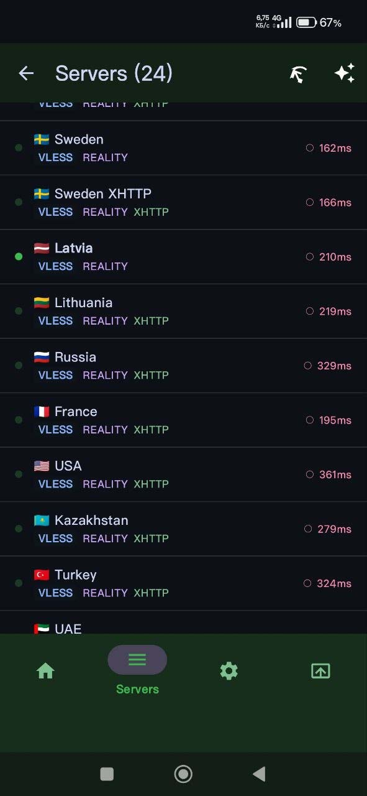
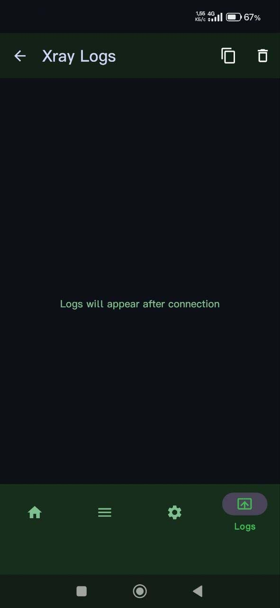
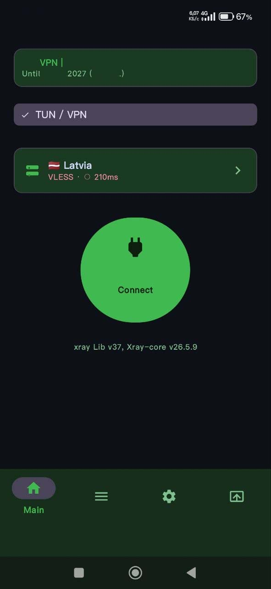
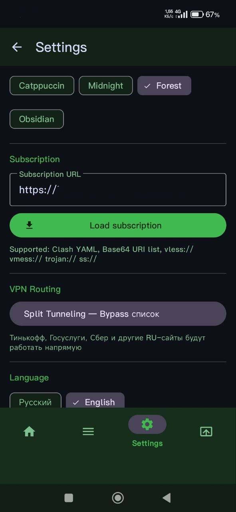

 # 
 
#   BearNest VPN

> **Private Android VPN client** powered by Xray-core and HevSocks5Tunnel.  
> Supports VLESS · VMess · Trojan · Shadowsocks protocols with subscription management.

---

## 📱 Screenshots

  <table><tr>
    <td></td>
    <td></td>
    <td></td>
    <td></td>
  </tr></table>
</p>
  
<!-- TODO: add screenshots after first release -->
_Coming soon_

--- 
## ✨ Features

| Feature | Description |
|---|---|
| **Multi-protocol** | VLESS, VMess, Trojan, Shadowsocks (via Xray-core) |
| **Subscription support** | Import servers by URL with auto-update |
| **Split Tunnel** | Per-app bypass — choose which apps skip the VPN |
| **Bypass domains** | Domain whitelist that routes outside the tunnel |
| **Server ping** | Check latency directly from the server list |
| **Auto-start on boot** | `BootReceiver` — VPN connects automatically after reboot |
| **Log viewer** | Built-in Xray log viewer |
| **Multilingual** | English · Russian |
| **Dark theme** | Material You, dark theme by default |

--- 
## 🏗️ Architecture

```
BearNestAndroid/
├── app/
│   └── src/main/
│       ├── kotlin/com/bearnest/vpn/
│       │   ├── core/               # Business logic
│       │   │   ├── ConfigGenerator.kt      — generates Xray JSON config
│       │   │   ├── SubscriptionParser.kt   — parses subscriptions (Base64 / URL)
│       │   │   ├── XrayManager.kt          — starts / stops the Xray process
│       │   │   ├── HevTunManager.kt        — manages HevSocks5Tunnel
│       │   │   ├── ServerPinger.kt         — server latency checks
│       │   │   └── BootReceiver.kt         — auto-start on boot
│       │   ├── data/               # Data layer
│       │   │   ├── AppDatabase.kt          — Room database
│       │   │   └── AppSettings.kt          — Jetpack DataStore settings
│       │   ├── model/              # Data models
│       │   │   ├── ServerConfig.kt
│       │   │   └── SubscriptionInfo.kt
│       │   ├── ui/                 # User interface
│       │   │   ├── MainActivity.kt
│       │   │   ├── MainViewModel.kt
│       │   │   ├── fragments/
│       │   │   │   ├── HomeFragment.kt         — main screen, connect button
│       │   │   │   ├── ServerListFragment.kt   — server list
│       │   │   │   ├── SettingsFragment.kt     — app settings
│       │   │   │   ├── SplitTunnelFragment.kt  — per-app split tunnel
│       │   │   │   └── LogFragment.kt          — log viewer
│       │   │   └── adapter/
│       │   │       ├── ServerAdapter.kt
│       │   │       ├── BypassDomainAdapter.kt
│       │   │       └── LogAdapter.kt
│       │   └── vpn/
│       │       └── BearVpnService.kt       — VpnService, TUN interface
│       ├── kotlin/com/v2ray/ang/service/
│       │   └── TProxyService.kt            — transparent proxy service
│       ├── jniLibs/arm64-v8a/
│       │   └── libhev-socks5-tunnel.so     — native library (HevSocks5Tunnel)
│       └── assets/xray/                    — Xray binaries (add manually)
└── build.gradle.kts
```

---
 
## 🛠️ Tech Stack

| Layer | Technology |
|---|---|
| Language | Kotlin |
| Min SDK | 26 (Android 8.0) |
| Target SDK | 35 |
| VPN Core | [Xray-core](https://github.com/XTLS/Xray-core) |
| Socks5 Tunnel | [hev-socks5-tunnel](https://github.com/heiher/hev-socks5-tunnel) |
| Database | Room (SQLite) |
| Settings | Jetpack DataStore |
| Architecture | ViewModel + Coroutines + Flow |
| UI | Material 3, ConstraintLayout, Bottom Navigation |
| Build System | Gradle KTS |

---
 
## ⚙️ Build & Run

### Requirements
- Android Studio Hedgehog or newer
- JDK 17+
- Android SDK 35

### Steps

**1. Clone the repository**
```bash
git clone https://github.com/YOUR_USERNAME/BearNestAndroid.git
cd BearNestAndroid
```

**2. Add Xray binaries**  
Download the `xray` binary for Android arm64 from [github.com/XTLS/Xray-core/releases](https://github.com/XTLS/Xray-core/releases) and place it at:
```
app/src/main/assets/xray/xray
```

**3. Open in Android Studio**  
`File → Open → BearNestAndroid`

**4. Sync Gradle**  
`File → Sync Project with Gradle Files`

**5. Run**  
`Run → Run 'app'` or `Shift + F10`

### Build Release APK
```bash
./gradlew assembleRelease
# Output: app/build/outputs/apk/release/app-release.apk
```

> ⚠️ To build a signed APK, create a `key.properties` file in the project root.  
> **Never commit `key.properties` or `.jks` files to version control!**

---

## 🔐 APK Signing (Release)

Create a `key.properties` file in the project root (it is already listed in `.gitignore`):

```properties
storePassword=YOUR_STORE_PASSWORD
keyPassword=YOUR_KEY_PASSWORD
keyAlias=YOUR_KEY_ALIAS
storeFile=../keystore/bearnest.jks
```

---

## 📄 Permissions

| Permission | Reason |
|---|---|
| `INTERNET` | VPN tunnel traffic |
| `FOREGROUND_SERVICE` | Background VPN service |
| `RECEIVE_BOOT_COMPLETED` | Auto-start after reboot |

---

## 🗺️ Roadmap 
- [ ] Roadmap - Roadmap

---
 
## 📜 License

Private repository. All rights reserved © 2026 BearNest.

---
 
